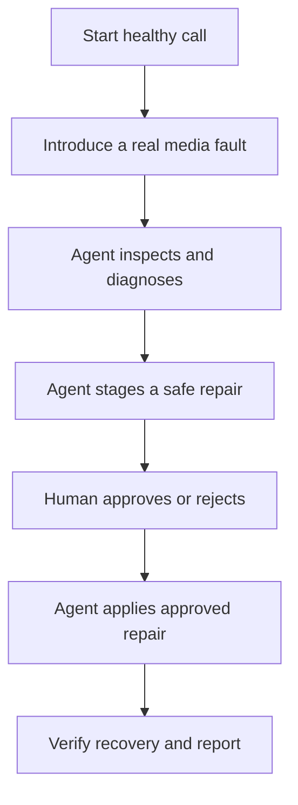
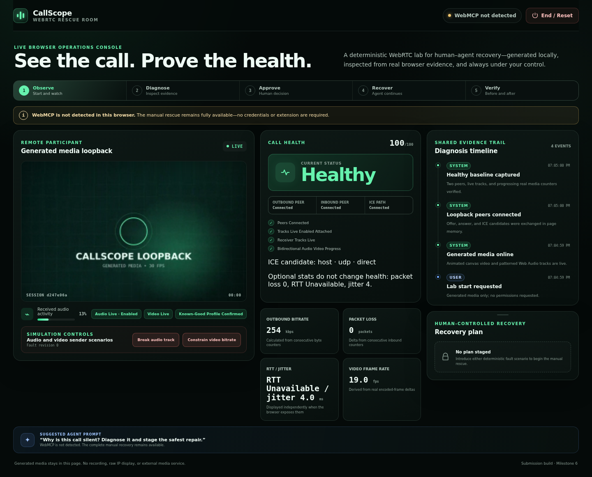
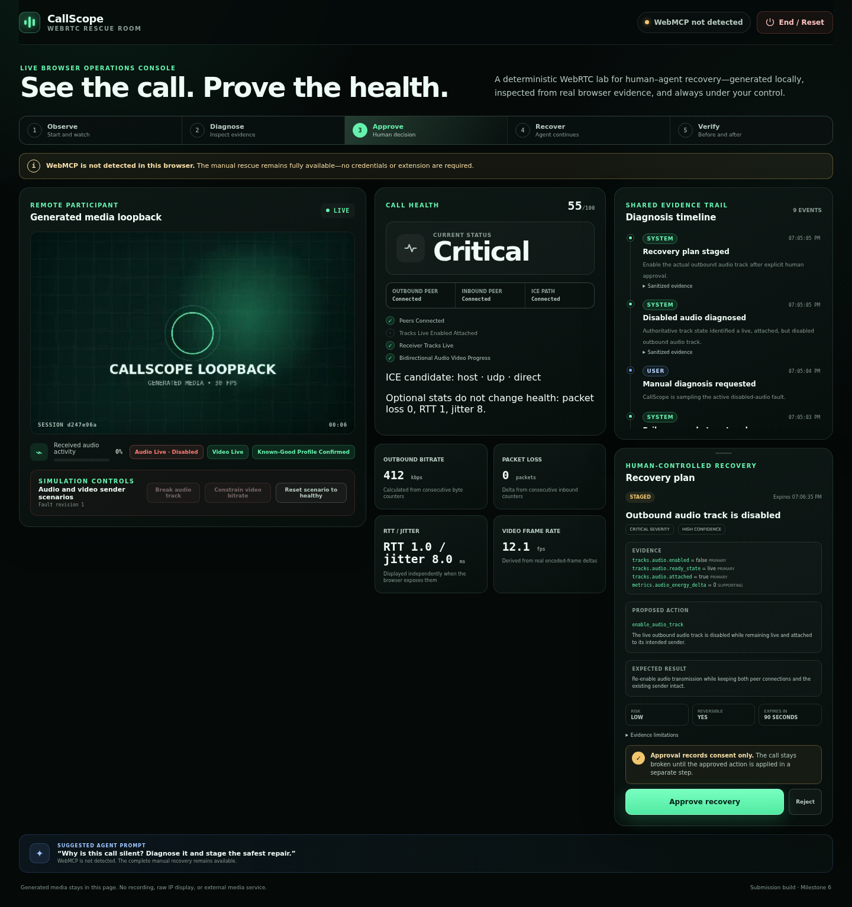
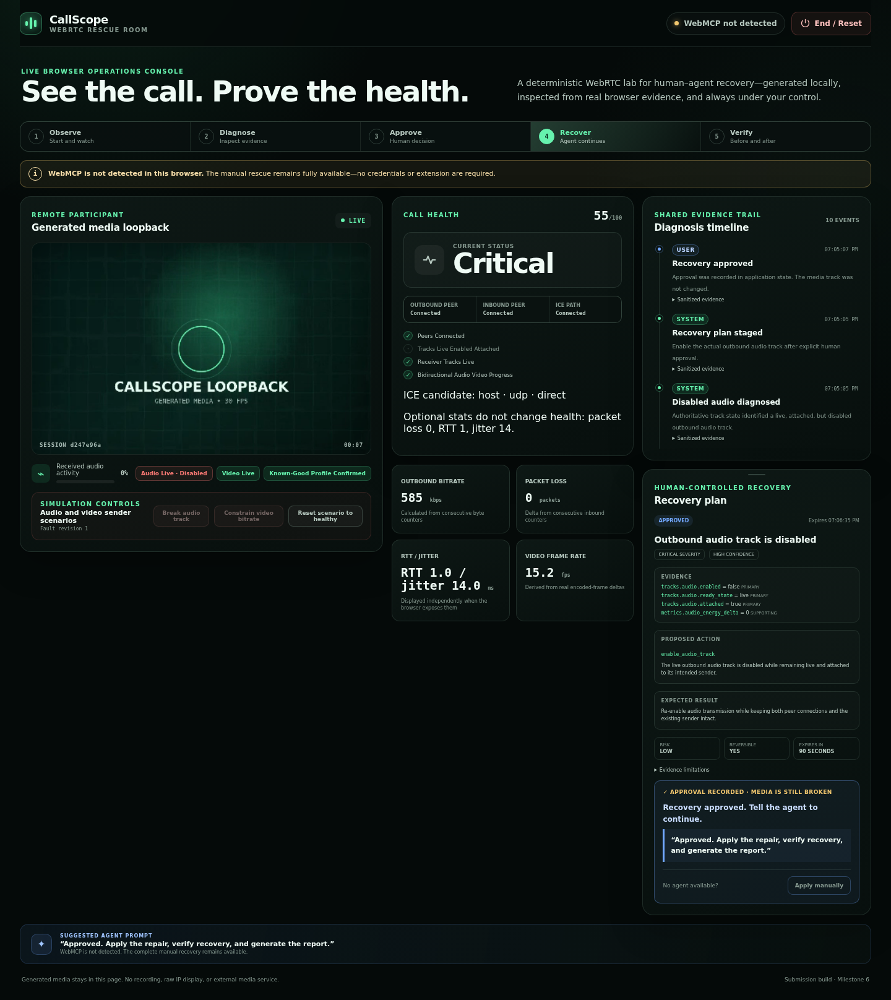
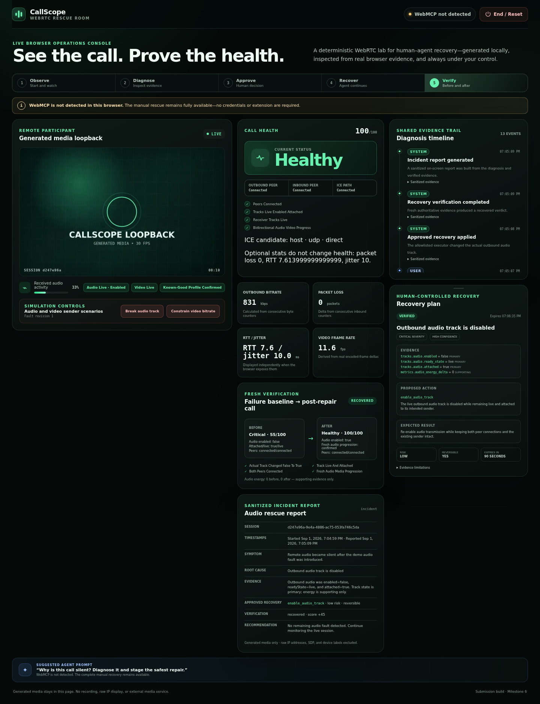
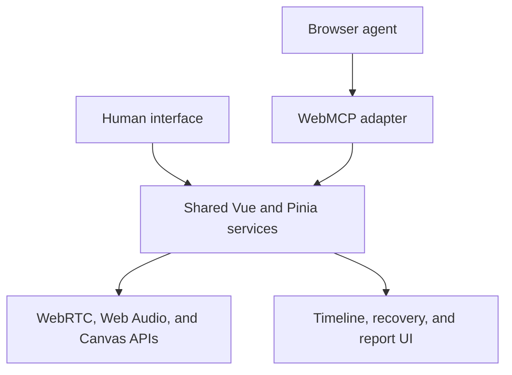

# CallScope

**The WebRTC Rescue Room**

CallScope is a browser-based workspace where a developer and an AI agent inspect, diagnose, repair, and verify a live WebRTC call together.

Instead of asking an agent to interpret screenshots or copied logs, CallScope exposes the active page's peer-connection, media-track, sender, and health state through seven focused WebMCP tools. The implementation completes both the safety-hardened disabled-audio hero rescue and the secondary constrained-video-bitrate rescue against the same runtime used by the manual controls.

**Live application:** <https://haitham113.github.io/callscope/>

The URL is the configured deployment target. See [verified limitations](#verified-limitations) before relying on its current deployment status.

> Observe → Diagnose → Explain → Propose repair → Human approval → Apply → Verify

CallScope is not a passive monitoring dashboard or a post-call log analyzer. Its defining experience is recovering a running browser call in the same interface where the person can see and control every action.

## Why CallScope?

WebRTC failures are difficult to troubleshoot because the useful evidence is spread across several live browser APIs:

- `RTCPeerConnection` and ICE states
- MediaStreamTrack state
- Sender attachment and encoding parameters
- Packet, byte, frame, jitter, loss, and RTT statistics
- Audio-energy and bitrate changes over time

CallScope converts that low-level, continuously changing state into structured evidence that an agent can reason about. It keeps the human in control of every state-changing recovery and then proves whether the call actually improved.

## The Experience



The default demonstration uses a real, deterministic WebRTC loopback session:

- Video is generated from an animated canvas.
- Audio is generated with the Web Audio API.
- Two in-page `RTCPeerConnection` objects exchange SDP and ICE candidates in memory.
- Real sender, receiver, track, and `getStats()` data drive the interface.
- No camera, microphone, account, API key, or backend is required.

## Hero Demo

1. Click **Start Demo Lab** and watch the generated call become healthy.
2. Click **Break audio track** to disable the actual outbound audio track.
3. Send the suggested first agent prompt:

   > Why is this call silent? Diagnose it and stage the safest repair.

4. The agent inspects and samples the live call, then identifies the disabled audio track.
5. The agent stages an `enable_audio_track` recovery with evidence, risk, reversibility, and expected result.
6. Approve or reject the plan in CallScope. Approval records application state only; media remains broken.
7. After approval, send the displayed continuation:

   > Approved. Apply the repair, verify recovery, and generate the report.

8. The agent applies the approved repair, compares the failure baseline with a fresh post-repair sample, and generates the sanitized report.

The visually secondary **Apply manually** control exercises the same shared runtime when WebMCP is unavailable.

The intended result is visible and measurable: **Critical → Recovering → Healthy**.

## Submission Screenshots

| Healthy | Staged recovery |
| --- | --- |
|  |  |

| Approved, still broken | Before/after recovery |
| --- | --- |
|  |  |

## Why WebMCP Is Essential

The state CallScope needs exists inside the active browser page while the call is running. It changes continuously and includes browser-owned objects that a backend cannot directly inspect or modify.

WebMCP allows the agent to:

- Read structured live state without scraping the DOM.
- Use the same diagnostic and recovery services as the human interface.
- Stage its proposed action visibly in the page.
- Respect application-enforced human approval.
- Repair the actual browser media state.
- Verify the result using fresh before-and-after evidence.

A traditional backend MCP integration would require duplicated session state, authentication, and a separate transport for rapidly changing browser metrics. Ordinary browser automation would have to infer technical state from UI text. WebMCP lets the agent work directly with the page's existing application logic while the page remains the shared human-agent workspace.

## WebMCP Tools

CallScope registers exactly seven focused tools when `document.modelContext.registerTool()` is available.

| Tool | Type | Purpose |
| --- | --- | --- |
| `get_lab_context` | Read-only | Returns the active session, health, fault, and recommended next tools. |
| `inspect_call_state` | Read-only | Returns sanitized peer, ICE, track, sender, receiver, and health state. |
| `run_call_diagnostics` | Read-only analysis | Samples live statistics and returns ranked, evidence-backed findings. |
| `stage_recovery_plan` | Non-destructive write | Displays a compatible proposed repair for human review. |
| `apply_recovery_action` | Confirmed state change | Applies one approved, unexpired, allowlisted repair. |
| `compare_to_failure_baseline` | Read-only verification | Compares the recovered call with the stored failure snapshot. |
| `generate_incident_report` | Non-destructive write | Produces and displays a sanitized incident summary or Markdown report. |

There is deliberately **no approval tool**. Only the human can approve or reject a staged recovery from the CallScope interface.

## Fault Scenarios

### Disabled audio track

CallScope sets the actual outbound audio track's `enabled` property to `false`.

Observable evidence includes:

- The audio track exists and remains live.
- The track is disabled.
- Audio energy stops progressing where the browser exposes it.
- Health becomes **Critical**.

The allowlisted recovery sets the track back to `enabled: true`.

### Constrained video bitrate

CallScope uses `RTCRtpSender.setParameters()` to apply a deliberately low `maxBitrate` to the video encoding.

Observable evidence includes:

- The sender contains an active bitrate constraint.
- Immediate sender-parameter readback confirms the configured cap.
- Measured outbound bitrate or frame behavior is displayed where available.
- Health becomes **Degraded**.

The allowlisted recovery restores the preserved known-good encoding profile and
verifies it with another immediate readback. Bitrate and frame changes are
supporting evidence only; noisy or unavailable loopback statistics do not block
a truthful recovery verdict. Switching between audio and video faults requires
an explicit **Reset scenario to healthy** action.

## Human Control and Safety

Recovery approval is enforced by application state, not by instructions to the agent.

- Every recovery is bound to the current session, diagnosis, and fault snapshot.
- Plans expire after 90 seconds or when the relevant state changes.
- Only enum-based, allowlisted actions can execute.
- Agent-authored text is displayed as untrusted content and never executed.
- The executor revalidates the state immediately before applying a repair.
- Rejected, expired, stale, mismatched, incompatible, or reused plans fail safely.
- Every user, agent, and system action appears in the shared timeline.
- Reset remains available to the human.
- Session UUIDs, monotonic epochs, and fault revisions prevent late work from owning a newer incident.
- Startup, diagnostic, recovery-verification, and wait operations are abortable and revalidated before committing results.
- Human and agent controllers expose separate capability sets; the agent set has no approval method.

Calling `apply_recovery_action` before approval returns a structured `PLAN_NOT_APPROVED` error and leaves the media state unchanged.

## Recovery Verification

CallScope does not treat a successful function call as proof of recovery. After a repair, it waits for fresh stabilized samples and compares them with the stored failure baseline.

Verification can include:

- Health status and score changes
- Track and sender-state changes
- Audio-energy recovery
- Bitrate and frame-rate changes
- Connection and ICE state
- Remaining diagnostic findings

The result is one of:

- `recovered`
- `partially_recovered`
- `not_recovered`

## Shared Timeline and Incident Report

CallScope makes the collaboration visible in the application rather than hiding it in chat. The timeline records:

- Snapshot capture
- Fault introduction
- Inspection
- Diagnosis
- Recovery staging
- Human approval or rejection
- Recovery execution
- Verification
- Report generation

The incident report summarizes the symptom, root cause, sanitized evidence, approved repair, verification result, and remaining recommendations. It is rendered on screen; optional Markdown download is not implemented.

## Architecture



Both manual controls and WebMCP tools call the same application services. The tool layer is an adapter—not a second implementation of the product logic.

Core responsibilities include:

- Generated audio/video creation and deterministic cleanup
- In-page WebRTC loopback lifecycle
- Statistics sampling and normalization
- Explainable health scoring
- Rule-based diagnosis and compatible-action selection
- Recovery staging, approval, expiry, and execution
- Before-and-after verification
- Sanitization and report generation
- WebMCP registration and lifecycle cleanup

All active session data remains in browser memory. Reloading the page returns CallScope to a clean state.

See [docs/architecture.md](docs/architecture.md) for module ownership, state binding, WebMCP capability separation, privacy boundaries, cleanup, and deployment flow.

## Technology

- Vue 3 Composition API
- Vite
- JavaScript
- Pinia
- Native WebRTC APIs
- Web Audio API
- Canvas API
- WebMCP `document.modelContext.registerTool()`
- Vitest
- Playwright
- Static HTTPS deployment

## Run Locally

### Requirements

- A recent Node.js LTS release
- npm
- A modern Chromium-based browser
- A WebMCP-supported environment to invoke the agent tools

### Install and start

```bash
npm ci
npm run dev
```

Open the local URL printed by Vite, then click **Start Demo Lab**.

### Production build

```bash
npm run build
npm run preview
```

The deployed WebMCP experience must be served over HTTPS.

## Testing

```bash
npm run test
npm run lint
npm run build
npm run test:e2e
npm run test:spikes
npm run test:plugin
npm run capture:screenshots
```

To run the installed Inspector extension-message check, provide either a
temporary Chrome profile containing the Inspector or an unpacked extension:

```bash
CALLSCOPE_WEBMCP_USER_DATA_DIR=/path/to/temporary-profile npm run test:plugin
```

The browser suite also builds the production application before starting its
local preview server.

`npm run test:plugin` requires an installed WebMCP Inspector profile path as described below; without that environment it is expected to skip rather than fabricate native plugin evidence. `npm run capture:screenshots` regenerates the four submission images from real generated media in the production preview.

The critical browser checks are:

- A generated call starts without camera or microphone permission.
- Both peer connections reach a connected state.
- Audio/video counters progress.
- The disabled-audio scenario changes the real outbound track state.
- The bitrate scenario changes real sender parameters and confirms cap/restoration from fresh readback.
- Scenario switching is blocked until an explicit healthy reset succeeds.
- Applying a repair before approval fails safely.
- An approved compatible repair changes the actual media state.
- Verification produces measurable before-and-after evidence.
- Authoritative snapshots and reports contain no raw IP address or SDP.
- Ending and restarting clears session-owned tracks, peers, timers, and state.
- Reset/end cancels startup, diagnosis, recovery, and verification without late mutation.
- Cleanup receipts assert real peers, tracks, AudioContext, animation, samplers, listeners, ICE work, and timers.
- Nested success/error/report data recursively removes IP addresses, SDP, device labels, and secret-bearing fields.
- Expired, stale, mismatched, incompatible, rejected, unknown, and used diagnoses/plans fail without media mutation.
- The exact seven WebMCP contracts register once, share one abort lifecycle, and cannot duplicate across remounts.
- A narrow `modelContext` test double proves handler wiring, and the optional Inspector test invokes the same path through the installed extension message channel.

## Browser Support

The complete agent experience requires a browser environment that supports WebMCP. CallScope feature-detects `document.modelContext.registerTool`, registers through one isolated adapter, and displays a clear readiness status.

When WebMCP is unavailable, the deterministic lab and manual controls remain usable, allowing the entire diagnostic and recovery workflow to be exercised without an agent.

CallScope is intended to be tested in:

- ChatGPT's in-app browser
- WebMCP-enabled Chrome
- A modern Chromium-based browser for the manual fallback

Browser statistics vary. CallScope treats authoritative track and sender state as primary evidence and reports unavailable metrics as unavailable rather than inventing zero values.

## Verified Limitations

- WebMCP is experimental and the complete agent path requires a client that exposes `document.modelContext.registerTool()`.
- ChatGPT's in-app browser cannot be automated from this repository; its deployed golden path must be verified manually in that supported client.
- The installed Inspector/plugin check requires a temporary Chrome profile or unpacked extension supplied through `CALLSCOPE_WEBMCP_USER_DATA_DIR` or `CALLSCOPE_WEBMCP_EXTENSION_PATH`.
- The manual fallback works in modern Chromium when WebMCP is absent. Safari and Firefox are not claimed as supported judging clients.
- Packet loss, jitter, RTT, measured bitrate, frame rate, and audio energy vary by browser and sample window. Unavailable values stay unavailable and do not override authoritative track/sender evidence.
- Visible video degradation is browser-dependent; sender-parameter readback, not appearance, proves the configured cap and restoration.
- Incident reports render on screen and can be returned as Markdown through WebMCP; file download and PDF export are intentionally not implemented.
- Active state is in memory. Reloading intentionally resets the incident instead of persisting it.
- The public Milestone 6 deployment passed the complete 31-test deployed Chrome suite on 2026-09-01. A broader follow-up contrast audit found one active workflow caption at 3.92:1; the local correction is verified and awaits deployment. Consult [the Milestone 6 validation record](docs/callscope_milestone6_validation.md) for current evidence and remaining gates.

## Privacy

- Media is generated locally; CallScope does not require real camera or microphone input.
- Audio and video are not recorded or uploaded.
- Session, diagnosis, recovery, and report data remain in memory.
- Raw local/public IP addresses are removed from tool outputs and reports.
- Complete SDP offers and answers are never exposed.
- Device labels, credentials, tokens, and secrets are excluded.
- Candidate information is reduced to safe categories such as type, protocol, and direct or relayed transport.

## Scope

CallScope focuses on one polished browser-based rescue experience. It does not require or include:

- A backend service or database
- Authentication or user accounts
- Uploaded WebRTC logs
- Production customer-call monitoring
- SIP, PBX, Janus, FreeSWITCH, FusionPBX, or Mediasoup
- Multi-party calling
- Autonomous repair
- Access to real customer calls

## OpenAI WebMCP Challenge

CallScope is built for the [OpenAI WebMCP Challenge](https://openai.com/webmcp-challenge/).

Its central idea is simple: the browser UI remains the shared workspace, WebMCP gives the agent structured access to the live call, and the human retains final authority over every repair.

Submission materials are synchronized in [`docs/submission/`](docs/submission/): the English challenge description, exact 2:30 demo script, public YouTube recording checklist, and final submission checklist.

CallScope is open source under the [MIT License](LICENSE).
